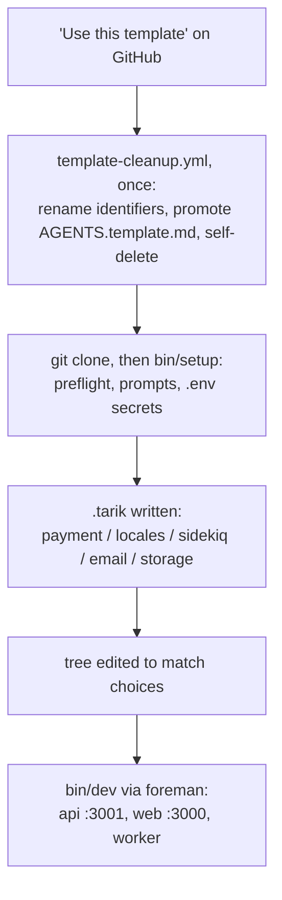

# Architecture

The technical brief: a guided tour of the six decisions that carry most of this codebase, each section stating the choice, the reasoning, and the trade-off accepted, with file paths throughout. The six: a template that configures itself and then removes its own scaffolding; auth as a Bearer header where the browser guard is only UX; payments as service objects on the raw `stripe` gem with idempotent webhooks; demo mode as a real feature fenced out of production; EN/JA i18n wired before the first feature; and Docker scoped to the data layer, with Sidekiq an option rather than a requirement. [SPEC.md](SPEC.md) is the full technical specification; this file is the shorter read.

## The template configures itself, then removes the evidence

A boilerplate has two setup problems a normal app does not: applying the owner's choices, and shedding its own identity. tarik solves the first with an interactive script and the second with a workflow that deletes itself.

[bin/setup](bin/setup) prompts once (payment processor, locales, Sidekiq, transactional email plus optional verification, S3 storage), writes the answers to a `.tarik` file so later runs skip the prompts, and applies them by editing the tree: a single-locale choice rewrites [frontend/i18n/routing.ts](frontend/i18n/routing.ts) and deletes the unused catalog files, opting out of Sidekiq strips the `worker:` line from [Procfile.dev](Procfile.dev) and flips `ACTIVE_JOB_QUEUE_ADAPTER` to `:async` in [.env.example](.env.example), and enabling email or storage uncomments the relevant gem, config, and env-var blocks. Before any of that it preflights the machine (Docker daemon fatal; Ruby, Node, and foreman versions as warnings), so a missing prerequisite fails at the check, not halfway through an install.

[.github/workflows/template-cleanup.yml](.github/workflows/template-cleanup.yml) handles identity. In a repository created from the template it promotes [AGENTS.template.md](AGENTS.template.md) to `AGENTS.md` (replacing tarik's own agent instructions with a starting point for the new project), renames the `tarik` identifiers (database names, Railway service names, the user-visible app title in the frontend and API locale catalogs) to the new repository's name, commits as `github-actions[bot]`, and deletes itself. Two guards make it safe: `github.event.repository.is_template` keeps it inert in tarik itself, and the existence of `AGENTS.template.md` is the sentinel that makes it run at most once.

The same "never start red" principle governs deploys: every step in [.github/workflows/deploy.yml](.github/workflows/deploy.yml) is gated on the `RAILWAY_TOKEN` secret existing (checked at step level, because secrets are not readable in a job-level `if`), so a fresh repo's Actions tab is green before its owner has made any platform decision.

The trade-off: the rename rides on exact-string `sed`, and the setup choices are one-way. Re-running `bin/setup` with different answers does not resurrect a deleted locale file or a removed worker line (SPEC.md § Interactive Setup documents this). Accepted, because a template initializes exactly once, and the alternative, a runtime configuration layer, would leave every generated project permanently carrying code for options it never chose.

## Auth is a header, and the browser guard is only UX

Sign-in returns a Devise JWT in the `Authorization: Bearer` response header. The client stores it in `localStorage` ([frontend/lib/auth.ts](frontend/lib/auth.ts)) and attaches it to every request ([frontend/lib/api.ts](frontend/lib/api.ts)); sign-out revokes it through the `jwt_denylist` table. No cookies anywhere, so [frontend/proxy.ts](frontend/proxy.ts) does locale routing only, and protected pages are client components that check for a token on mount and redirect ([frontend/app/[locale]/dashboard/page.tsx](frontend/app/%5Blocale%5D/dashboard/page.tsx) is the reference implementation).

The reasoning is the project's first principle: the API must stay frontend-agnostic. A mobile app, a CLI, or a third-party integration authenticates exactly like the web client, with one Bearer mechanism and no CORS credential configuration. The client-side redirect is UX, not security; what protects data is the API returning `401` to any request without a valid token, which holds no matter what the browser does. On top of it sit rack-attack throttles ([api/config/initializers/rack_attack.rb](api/config/initializers/rack_attack.rb)) keyed per IP and per email address, and a 15-character-minimum, no-complexity-rules password policy per NIST SP800-63B. The full rationale, the account lifecycle (reset, email and password change, deletion, optional `:confirmable`), and the bcrypt reasoning behind the 128-character cap live in [docs/auth.md](docs/auth.md), the single source of truth for auth.

The trade-off: authenticated pages are client-rendered, so gated content gets a loading state on first paint and no SSR. Next.js is kept for where it pays, Server Components on the public surface that faces search engines. If a product needs server-rendered authenticated pages, [docs/auth.md](docs/auth.md) documents the `HttpOnly`-cookie switch as a frontend-only change; the Rails API does not move.

## Payments are service objects on the raw stripe gem

All Stripe logic sits behind the [`PaymentService`](api/app/services/payment_service.rb) facade, delegating to [`Payments::ChargeService`](api/app/services/payments/charge_service.rb) (one-time payments), [`Payments::SubscriptionService`](api/app/services/payments/subscription_service.rb) (Stripe Checkout sessions and cancellation), and [`Payments::WebhookService`](api/app/services/payments/webhook_service.rb) (event handling). Controllers handle params and rendering only; models handle persistence only. The `pay` gem was rejected deliberately: it couples the codebase to its abstractions, and the explicit service layer provides the same separation without the magic.

The webhook path verifies the Stripe signature, then makes replays harmless: [`ProcessedStripeEvent.record`](api/app/models/processed_stripe_event.rb) is a `create!` rescuing `ActiveRecord::RecordNotUnique`, so Stripe's at-least-once delivery collapses to exactly-once processing. Without it, a replayed `checkout.session.completed` would destroy and recreate the subscription row. The handler also reads billing periods from the subscription item rather than the subscription, tracking Stripe's Basil API change, with a comment in the file saying so.

This shape is also what makes the [PAY.JP migration guide](docs/payjp-migration.md) possible: swapping processors is nine steps through the service layer with no controller or model changes, aimed at Japan's Ruby ecosystem where PAY.JP is the common fixture. The trade-off is that everything `pay` would provide free (billing portal sync, dunning helpers, multi-processor support) must be hand-built if needed. Accepted: a boilerplate should hand over a payment layer its owner can read in one sitting.

## Demo mode is a real feature, fenced out of production

`DEMO_MODE=true` lets an evaluator walk sign-up to active subscription without a Stripe account. [`Payments::SubscriptionService`](api/app/services/payments/subscription_service.rb) returns a `DemoSession` struct in place of a Checkout redirect and writes an active subscription locally, and [api/db/seeds.rb](api/db/seeds.rb) creates two accounts: `demo@tarik.dev` already subscribed, `demo-new@tarik.dev` empty, so both halves of the subscription UI are visible immediately.

Because the credentials are publicly documented, the fence matters more than the feature. [api/config/initializers/demo_mode.rb](api/config/initializers/demo_mode.rb) raises at boot when `DEMO_MODE=true` in any environment other than development or test, allowlisting the safe environments rather than blocklisting production; a blocklist would have let a staging environment silently bypass all payment processing while seeding a known credential pair. The seeds carry the same guard.

The trade-off: demo branches live inside production code paths, a `demo_mode?` conditional at the top of the service methods. Accepted as the cost of a demo that exercises the real UI rather than a separate mock app; the branches are small and grep-able.

## i18n was wired before the first feature

English and Japanese exist from the first line of code: a `[locale]` URL segment with next-intl on the frontend ([frontend/i18n/routing.ts](frontend/i18n/routing.ts), catalogs [frontend/i18n/en.json](frontend/i18n/en.json) and [ja.json](frontend/i18n/ja.json)), rails-i18n catalogs on the API ([api/config/locales/en.yml](api/config/locales/en.yml), [ja.yml](api/config/locales/ja.yml)), an [`AcceptLanguage` middleware](api/app/middleware/accept_language.rb) that parses q-values to pick the locale for anonymous requests, and a `locale` column on users that wins after sign-in. The hard rule, enforced by convention and [AGENTS.md](AGENTS.md): no component or view hardcodes a string; everything goes through `t()`.

The reasoning: retrofitting i18n after ten components exist is expensive, and building on top of it is free. This is also why the single-locale choice in `bin/setup` keeps the `t()` pattern rather than inlining strings: a project that starts EN-only can add Japanese later by restoring one catalog file and one entry in `routing.ts`.

The trade-off, and its known limit: every string costs a key in two catalogs, and nothing enforces parity between them. A key present in only one language renders as a missing-key placeholder, and no CI check fails when that happens; parity here is a convention, not a gate.

## Docker carries the data layer; the app runs native; Sidekiq is optional

[docker-compose.yml](docker-compose.yml) runs exactly two containers, Postgres 18 and Redis 8, the same versions [ci.yml](.github/workflows/ci.yml) declares as service containers. Rails and Next.js run natively, started together by foreman ([bin/dev](bin/dev), [Procfile.dev](Procfile.dev)). Parity where drift actually hurts (data-store versions and configuration), native processes where feedback speed matters (no container rebuild per code change).

Redis is not only Sidekiq's backend: the rack-attack throttle counters live there so rate limits hold across replicas, with a documented fallback to the default Rails cache when `REDIS_URL` is absent. Background jobs switch on one env var, `ACTIVE_JOB_QUEUE_ADAPTER`, and opting out of Sidekiq during `bin/setup` strips the worker process and sets `:async`.

The trade-off: contributors install two native runtimes (Ruby 3.4.9 and Node 24, pinned in [.tool-versions](.tool-versions) and checked by the setup preflight) instead of getting a fully containerized dev environment, and the `:async` adapter loses queued jobs on process restart, which is acceptable in development and is why the default answer ships Sidekiq.
